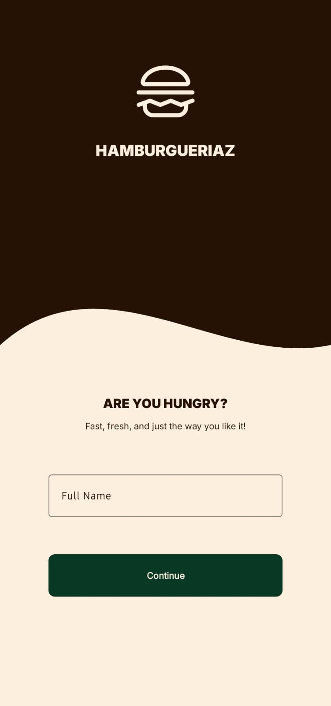
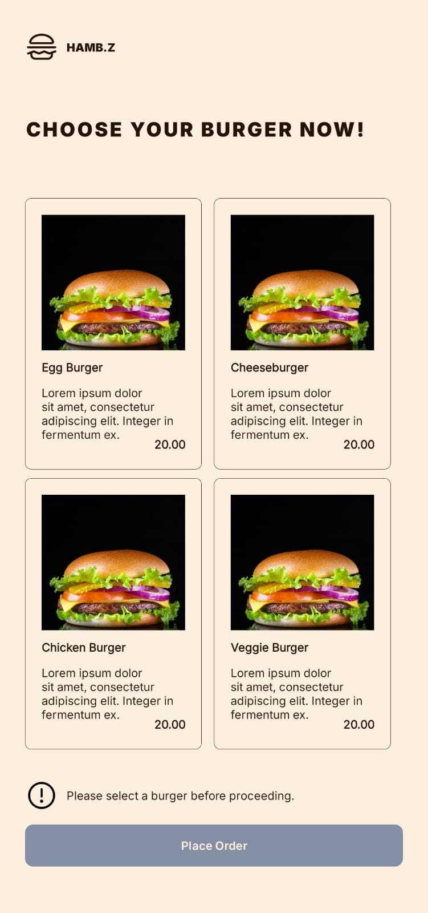
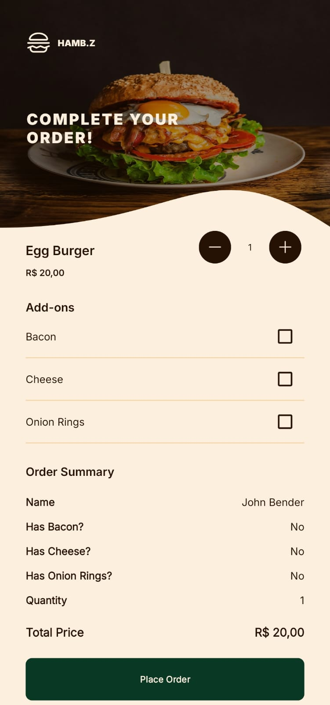

# 🍔 Burger Order App

Aplicativo Android desenvolvido como parte das aulas práticas da disciplina de Desenvolvimento
Mobile. O projeto simula um sistema de pedidos de hambúrgueres, permitindo que o usuário selecione
um item do cardápio, personalize com adicionais, ajuste a quantidade e envie um resumo do pedido por
e-mail.

## 🛠 Tecnologias Utilizadas

- **Java**
- **Android Studio**
- **ViewBinding**
- **RecyclerView + Adapter + ViewHolder**
- **Intent e navegação entre Activities**
- **Internacionalização (i18n)**
- **Envio de e-mail com `Intent.ACTION_SENDTO`**

## 📱 Funcionalidades

- Tela de **Login** com validações e suporte a múltiplos idiomas.
- Tela de **Seleção de Hambúrgueres** com lista dinâmica utilizando RecyclerView.
- Tela de **Resumo do Pedido** com:
    - Detalhes do hambúrguer selecionado
    - Adicionais (bacon, queijo, onion rings)
    - Quantidade ajustável
    - Cálculo automático de valor total
    - Envio do pedido via e-mail com informações pré-preenchidas

## 📷 Capturas de Tela

| Login                                                | Seleção de Hambúrguer                                                | Resumo do Pedido                                        |
|------------------------------------------------------|----------------------------------------------------------------------|---------------------------------------------------------|
|  |  |  |
